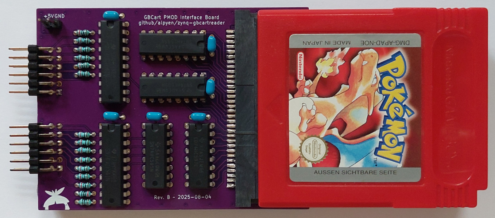
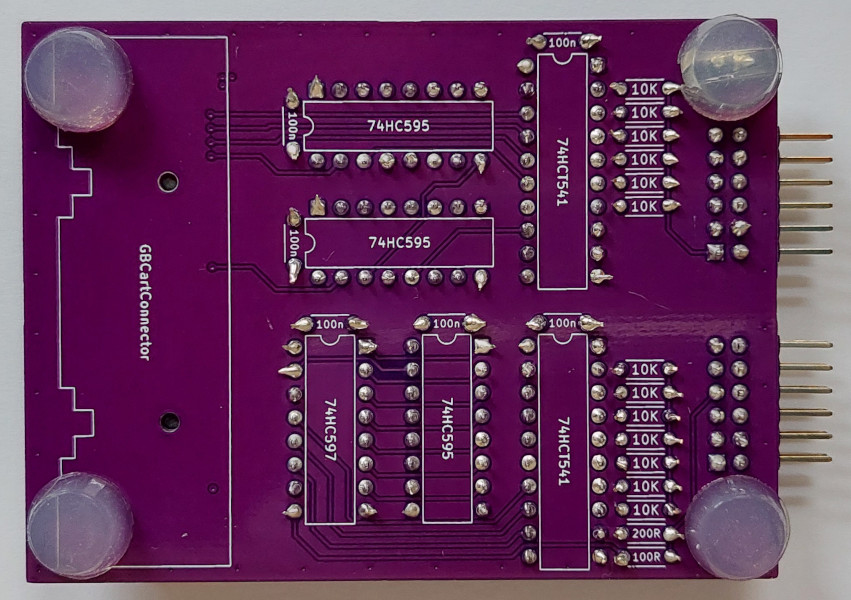

# ZYNQ GBCartReader - Read & Write GameBoy cartridges

This project is aimed to dive into FPGA SoCs and embedded software development
by designing a system that's able to read and write to gameboy cartridges with
a custom designed PCB which interfaces between the FPGA and the game cartridge.

Starting from a very basic bitbanging implementation solely running on the ARM core,
the following design iterations will make use of a more sophisticated architecture
by offloading the board communication to an IP core and moving commands and responses
around with AXI interfaces.

<div align="center">
   
   <br>
   A (badly) handsoldered demonstration of this project with a Pokémon Red cartridge.<br>
   Left is Top, Right is Bottom.
</div>


## Navigation

1. [Supported Cartridge Types](#supported-cartridge-types)
2. [Reading and Writing Cartridges](#reading-and-writing-cartridges)
   1. [Reading ROM / RAM](#reading-rom--ram)
   2. [Writing RAM](#writing-ram)
3. [Setting up the FPGA-board](#setting-up-the-fpga-board)
   1. [Hardware Design with Vivado](#hardware-design-with-vivado)
   2. [Software Application with Vitis](#software-application-with-vitis)
4. [Acknowledgements](#acknowledgements)
5. [Todo-List](#todo-list)


## Supported Cartridge Types

There are a couple of different cartridge types that mostly distinguish between the type of
mapper chip and additional periphery such as RAM, Real-Time-Clock, Battery and more. Here's
a list of the ones that are available:

|  Type  | Status | Verified On                                                                                  |
| :----: | :----: | :------------------------------------------------------------------------------------------- |
| No MBC |   ✅   | Motocross Maniacs (DMG-MX-NOE)<br> Othello (DMG-OT-NOE)                                      |
|  MBC1  |   ✅   | ポケットモンスター 緑 (DMG-APBJ-JPN)<br> Super Mario Land (DMG-ML-NOE)                       |
|  MBC2  |   ✅   | F-1 RACE (DMG-F1-NOE)                                                                        |
|  MBC3  |   ✅   | Pokémon Crystal (CGB-BYTD-NOE)<br> Pokémon Silver (DMG-AAXD-NOE)                             |
|  MBC5  |   ✅   | Pokémon Red (DMG-APAD-NOE)<br> Pokémon Blue (DMG-APED-NOE)<br> Pokémon Yellow (DMG-APSD-NOE) |
| MBC30  |   ✅   | ポケットモンスター クリスタルバージョン (CGB-BXTJ-JPN)                                       |

Some exotic cartridges exist which are not supported. For an exhaustive list check the <a href="https://gbdev.io/pandocs/MBC2.html">Pan Docs</a>
and <a href="https://gbhwdb.gekkio.fi/cartridges/gb.html">GameBoy hardware database</a>. Most games simply use No MBC, MBC1, 3 or 5.
If I own any of the uncommon ones I'll implement them, otherwise I'll skip them as I cannot verify them.

This project supports reading the ROM, reading and writing to RAM allowing you to dump games, backup save files
and also restore save files back to the cartridge. Reading and Writing RTC data is not supported.

I've noted that some games can underreport the number of ROM or RAM banks, for example ポケットモンスター 緑 or ポケットモンスター クリスタルバージョン.
They only report half as many banks present, but manually fixing them in the software dumps these correctly too.


## Reading and Writing Cartridges

This step assumes you have your FPGA-board configured with the application up and running.

Interfacing with the FPGA-board is done through python scripts by sending data over a serial port. Please refer to [Setting up the virutal environment](https://github.com/alpyen/fpga-mediaplayer/blob/main/docs/python.md#setting-up-the-virtual-environment) on how to create a virtual environment and install the pip packages (pyserial) to use the scripts.

The board communicates with a baudrate of `115200` and is plugged in to `/dev/ttyUSB1` on my machine.

Check if your setup is healthy by runing the help command:
```console
(.venv) zynq-gbcartreader/python$ python reader.py -b 115200 -p /dev/ttyUSB1 help
Sending command: help
Receiving data...482B/482B...done!
ZYNQ GBCartReader - Read & Write Gameboy cartridges
written by alpyen - visit the project on github.com/alpyen/zynq-gbcartreader

Available commands:
-------------------
help          Display this help page
parse header  Read cartridge header and parse into readable form
read rom      Read cartridge rom and echo it in binary
read ram      Read cartridge ram (if available) and echo it in binary
write ram     Write cartridge ram (if available) from binary terminal data
```

A help screen should be printed which is sent by the applicaton running on the FPGA-board.
If you do not receive any text or the connection hangs, make sure to correctly flash the board, and check your access permissions on that serial port.

### Reading ROM / RAM

Plugging in a Pokémon Crystal cartridge (CGB-BYTD-NOE) I can read out its header:
```console
(.venv) zynq-gbcartreader/python$ python reader.py -b 115200 -p /dev/ttyUSB1 parse header
Sending command: parse header
Receiving data...851B/851B...done!
Overview:
  Entry Point:       00 C3 6E 01
  Nintendo Logo:     Good
  Title:             PM_CRYSTAL
  Manufac. Code (?): BYTD
  CGB Flag:          CGB exclusive
  New Licensee Code: Nintendo Research & Development 1
  SGB Flag:          No
  Type:              MBC3 + RTC + RAM + Battery
  ROM Size:          2048 KiB (128 banks)
  RAM Size:          32 KiB (4 banks)
  Destination Code:  Overseas
  Old Licensee Code: Check New Licensee Code
  Version:           00
  Header Checksum:   28
  Global Checksum:   49 82

Full Header:
  0x0100:  00 C3 6E 01 CE ED 66 66 CC 0D 00 0B 03 73 00 83
  0x0110:  00 0C 00 0D 00 08 11 1F 88 89 00 0E DC CC 6E E6
  0x0120:  DD DD D9 99 BB BB 67 63 6E 0E EC CC DD DC 99 9F
  0x0130:  BB B9 33 3E 50 4D 5F 43 52 59 53 54 41 4C 00 42
  0x0140:  59 54 44 C0 30 31 00 10 06 03 01 33 00 28 49 82
```

Now all you have do to dump this cartridge is to use the `read rom` function. The python script will
output the contents onto `stdout` while printing the current progress onto `stderr`. Pipe the result
into a file like so:
```console
(.venv) zynq-gbcartreader/python$ python reader.py -b 115200 -p /dev/ttyUSB1 read rom > cartridge.gb
Sending command: read rom
Receiving data...2048K/2048K...done!
```

The file extension does not really matter, it is recommended to simply use one that
downstream tools like emulators or inspection tools can handle.

Dumping the cartridge RAM is as straightforward, simply replace `read rom` with `read ram`.

### Writing RAM

Use `write ram` and either pipe in the RAM file or redirect `stdin` like so:
```
(.venv) zynq-gbcartreader/python$ python reader.py -b 115200 -p /dev/ttyUSB1 write ram < cartridge.sav
Sending command: read rom
Receiving data...2048K/2048K...done!
```

> Note: Since RTC reads/writes are not implemented some games may ask you to re-set the clock.


## Setting up the FPGA-board

This project was developed with Vivado/Vitis 2025.1 and uses scripts for these versions.
It should be possible to recreate the projects with minimal hassle on different versions.

### Hardware Design with Vivado

> Note: This step can be skipped if a pre-built XSA is downloaded from the releases section.
> Place it in the vivado subfolder and continue with the [Vitis](#software-application-with-vitis) section.

You can regenerate the project by starting Vivado and opening the tcl console.
Navigate with `cd` into the vivado subfolder and run: `source regenerate.tcl`

Vivado will rebuild the project from the source files. Once that's done you can
generate the wrappers for the different block design implementations, synthesize
and export the XSA files for use in Vitis.

> Note: The automatic wrapper generation is not implemented for now.

The board used in this project is a PYNQ-Z2 but any Zynq-7000 SoC with two PMOD headers can be used.

### Software Application with Vitis

Vitis offers a python interface to dispatch commands from scripts to the application.
In order to use this, you need to source the settings64.sh from the Vitis installation.
If you've installed the Xilinx tools in the default location then open up a new terminal
and load the settings by running these commands based on your operating system:

- Windows: `call C:/Xilinx/2025.1/Vitis/settings64.bat`
- Linux: `source /opt/Xilinx/2025.1/Vitis/settings64.sh`

In the same terminal navigate with `cd` into the vitis subfolder of this repository
and run: `vitis -s regenerate.py`

> Note: This script has to be run from Vitis, it will not work with your local python installation.

The script takes care of several things:
1. Performs sanity checks to see if the execution environment is correct and if the
   XSA files have been exported, otherwise the platform generation will fail.
2. Delete **everything** except the regenerate.py inside the vitis subfolder to remove
   a potentionally old workspace.
3. Regenerate the different platforms and applications used to run it on the board.
4. Link sources located outside the vitis workspace to into the projects.

Once the regeneration is complete you can open the Vitis GUI and set the workspace
to the vitis subfolder. Now you're ready to build the applications and deploy them.


## Acknowledgements

This project heavily relies on the work of others who have reverse engineered and documented
the inner workings of the Game Boy and its cartridges and/or compiled existing information:
- Pan Docs - https://github.com/gbdev/pandocs
- Game Boy: Complete Technical Reference - https://github.com/Gekkio/gb-ctr


## Todo-List

- Port bare-metal app to MicroBlaze on a Basys3
- Clean up
- Implement header checksum calculation in parse_header
- Do the actual work in an IP-Core and communicate with PS instead of bitbanging
