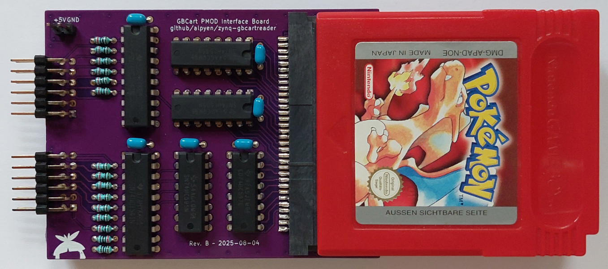

### Note: This project is a work in progress and is being actively developed.
___

# ZYNQ GBCartReader - Read & Write GameBoy cartridges

This project is aimed to dive into FPGA SoCs and embedded software development
by desining a system that's able to read and write to gameboy cartridges with
a custom designed PCB which interfaces between the FPGA and the game cartridge.

Starting from a very basic bitbanging implementation solely running on the ARM core,
the following design iterations will make use of a more sophisticated architecture
by offloading the board communication to an IP core and moving commands and responses
around with AXI interfaces.

   
    
   A (badly) handsoldered demonstration of this project with a Pokémon Red cartridge. 
   Left is Top, Right is Bottom.

## Quick Start

This project was developed with Vivado/Vitis 2025.1 and uses scripts for these versions.
It should be possible to recreate the projects with minimal hassle on older versions.

### Vivado

You can regenerate the project by starting Vivado and opening the tcl console.
Navigate with `cd` into the vivado subfolder and run: `source regenerate.tcl`

Vivado will rebuild the project from the source files. Once that's done you can
generate the wrappers for the different block design implementations, synthesize
and export the XSA files for use in Vitis.

> Note: The automatic wrapper generation is not implemented for now.

### Vitis

Vitis offers a python interface to dispatch commands from scripts to the application.
In order to use this, you need to source the settings64.sh from the Vitis installation.
If you've installed the Xilinx tools in the default location then open up a new terminal
and load the settings by running these commands based on your operating system:

- Windows: `call C:/Xilinx/2025.1/Vitis/settings64.bat`
- Linux: `source /opt/Xilinx/2025.1/Vitis/settings64.sh`

In the same terminal navigate with `cd` into the vitis subfolder of this repository
and run: `vitis -s regenerate.py`

> Note: This script has to be run from Vitis, it will not work with your local python installation.

The script takes care of several things:
1. Performs sanity checks to see if the execution environment is correct and if the
   XSA files have been exported, otherwise the platform generation will fail.
2. Delete **everything** except the regenerate.py inside the vitis subfolder to remove
   a potentionally old workspace.
3. Regenerate the different platforms and applications used to run it on the board.
4. Link sources located outside the vitis workspace to into the projects.

Once the regeneration is complete you can open the Vitis GUI and set the workspace
to the vitis subfolder. Now you're ready to build the applications and deploy them.

___

### Acknowledgements

This project heavily relies on the work of others who have reverse engineered and documented
the inner workings of the Game Boy and its cartridges and/or compiled existing information:
- Pan Docs - https://github.com/gbdev/pandocs
- Game Boy: Complete Technical Reference - https://github.com/Gekkio/gb-ctr
